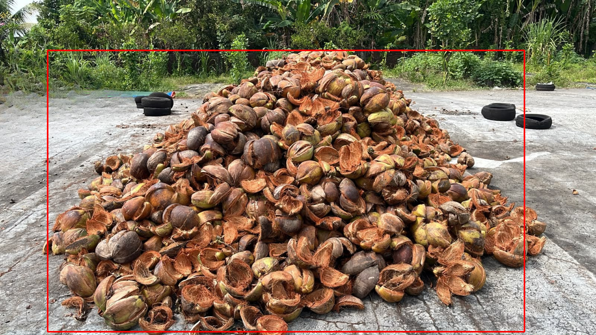
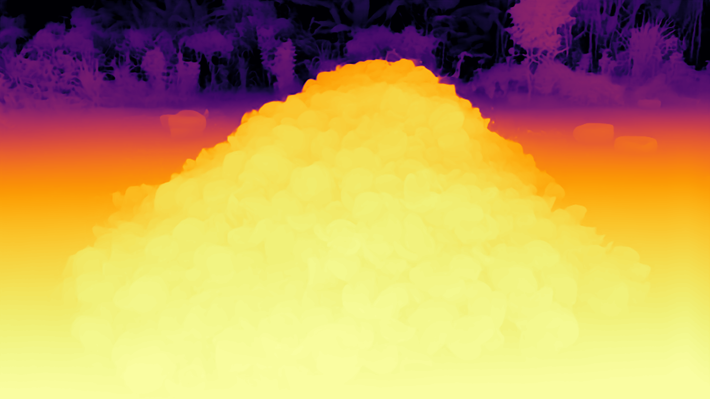
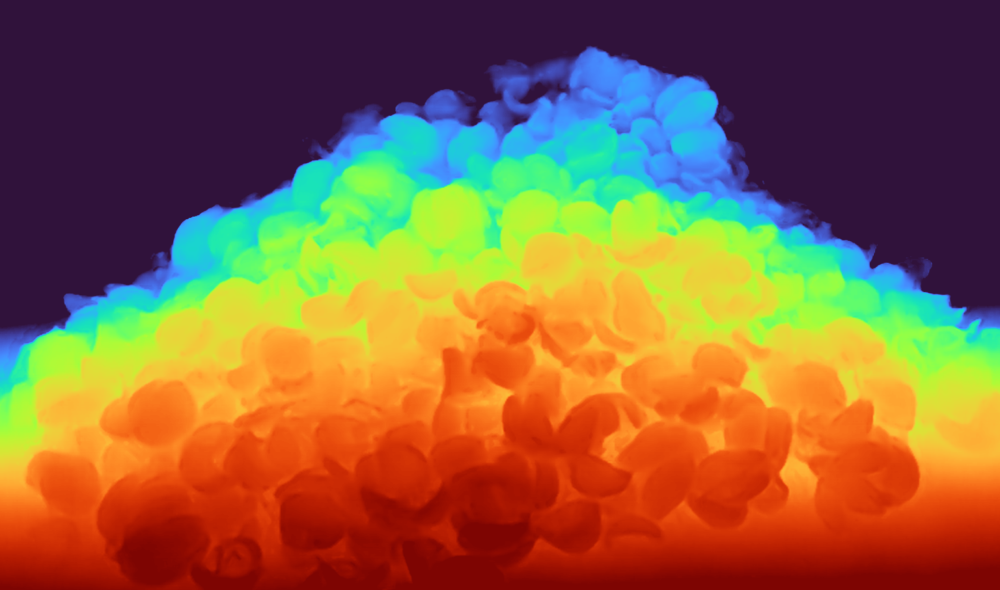

# Coconut Shell Stockpile Volume & Tonnage Estimator

A computer-vision tool that estimates the **volume (m³)** and **tonnage (ton)** of a coconut shell stockpile from a single photo, a video, or a live webcam feed. It uses a pretrained monocular depth estimation model ([Depth Anything V2 - Metric Indoor Large](https://huggingface.co/depth-anything/Depth-Anything-V2-Metric-Indoor-Large-hf)) to reconstruct a height map of the pile, then converts that height map into volume and tonnage using simple camera geometry.

## How It Works

1. **Depth estimation** — the input image/frame is passed through a pretrained depth model to produce a per-pixel depth map.
2. **Region of interest (ROI)** — a configurable crop is applied to focus on the stockpile area and ignore background/floor clutter.
3. **Height reconstruction** — using the camera's height and horizontal distance to the pile, each pixel's depth is converted into a real-world height above the ground.
4. **Volume & tonnage** — pixel heights are converted to real-world area using the camera's horizontal field of view, then summed into a volume estimate. Volume is multiplied by a configurable specific gravity to get tonnage.
5. **Visualization** — the tool saves a color-mapped depth image, an ROI overlay, and a height heatmap for inspection.

## Project Structure

```
STOCKPILE-BATOK-KELAPA/
├── Output/                 # Generated results (depth maps, ROI overlays, height maps, logs)
├── batok.py                # Main script 
├── requirements.txt        # Python dependencies
├── batokbesar.png          # Sample input image (large pile)
├── batokkecil.png          # Sample input image (small pile)
├── batoksedang.png         # Sample input image (medium pile)
└── testvideo.mp4           # Sample input video
```

## Installation

```bash
git clone https://github.com/moktaviani/Coconut-Shell-Stockpile-Volume-and-Tonnage-Estimator.git
cd Coconut-Shell-Stockpile-Volume-and-Tonnage-Estimator
pip install -r requirements.txt
```

> Requires Python 3.9+. A CUDA-capable GPU is recommended but not required — the script automatically falls back to CPU.

## Usage

**Single image:**
```bash
python batok.py --image batok.png
```

**Video file:**
```bash
python batok.py --video path/to/video.mp4
```

**Live webcam:**
```bash
python batok.py --webcam
```

**Webcam with custom device ID, inference interval, and saved output video:**
```bash
python batok.py --webcam --camera-id 1 --infer-interval 5 --save-video
```

**Video with saved annotated output, limited to first 900 frames:**
```bash
python batok.py --video path/to/video.mp4 --save-video --max-frames 900
```

### Arguments

| Argument | Description | Default |
|---|---|---|
| `--image` | Path to a single input image | — |
| `--video` | Path to an input video file | — |
| `--webcam` | Use a live webcam feed | — |
| `--camera-id` | Webcam device ID | `0` |
| `--infer-interval` | Seconds between AI inference runs (video/webcam mode) | `3.0` |
| `--save-video` | Save an annotated output video to `Output/` | off |
| `--max-frames` | Limit the number of frames processed (video mode) | none |

## Configuration

Key parameters can be tuned at the top of `batok.py` in the `CONFIG` dictionary:

| Parameter | Description | Default |
|---|---|---|
| `model_id` | Hugging Face depth model used for inference | `depth-anything/Depth-Anything-V2-Metric-Indoor-Large-hf` |
| `camera_height_m` | Camera height above the ground (m) | `2.0` |
| `horizontal_distance_m` | Horizontal distance from camera to the base of the pile (m) | `2.0` |
| `roi` | Region of interest as `(x1, y1, x2, y2)` fractions of the frame | `(0.08, 0.15, 0.88, 0.99)` |
| `specific_gravity_ton_per_m3` | Density used to convert volume to tonnage | `0.46` (460 kg/m³) |
| `outlier_clip_percentile` | Percentile used to clip height outliers | `98` |
| `camera_horizontal_fov_deg` | Camera horizontal field of view (degrees) | `60.0` |

Adjust `camera_height_m`, `horizontal_distance_m`, and `camera_horizontal_fov_deg` to match your actual camera setup for accurate real-world measurements.

## Output

Depending on the mode, results are saved to the `Output/` folder:

- **Image mode**: `<name>_depthmap.png`, `<name>_roi.png`, `<name>_heightmap.png`
- **Video/webcam mode**: `<name>_log.csv` (timestamped volume/tonnage log) and, if `--save-video` is set, `<name>_annotated.mp4`

### Sample Results (Image Mode)

| Original ROI | Depth Map | Height Map |
|---|---|---|
|  |  |  |

```bash
============================================================
 COCONUT SHELL STOCKPILE ESTIMATION RESULTS
============================================================
 Camera-to-Base Distance : 2.83 m
 Camera Tilt Angle       : 45.0°
 Estimated Volume        : 2.43 m³
 Estimated Tonnage       : 1.12 ton
 Maximum Height          : 0.85 m
 Average Height          : 0.55 m
 Density Used            : 0.46 t/m³
============================================================

Visualization files saved to:
  - Output/image_depthmap.png
  - Output/image_roi.png
  - Output/image_heightmap.png
```

### Sample Results (Video Mode)

| Time (s) | Volume (m³) | Tonnage (ton) | Max Height (m) | Mean Height (m) |
|---------:|------------:|--------------:|---------------:|----------------:|
| 0.00 | 1.608 | 0.739 | 0.862 | 0.514 |
| 3.00 | 1.764 | 0.811 | 0.885 | 0.517 |
| 6.00 | 1.736 | 0.798 | 0.831 | 0.480 |
| 9.00 | 1.897 | 0.873 | 0.796 | 0.525 |
| 12.00 | 2.378 | 1.094 | 0.859 | 0.578 |
| 15.00 | 2.396 | 1.102 | 0.849 | 0.557 |

> The complete log is saved as `Output/video_log.csv`.

## Notes & Limitations

- Estimates are only as accurate as the camera geometry parameters (`camera_height_m`, `horizontal_distance_m`, `camera_horizontal_fov_deg`) — measure these carefully for your real setup.
- The depth model is a general-purpose pretrained model, not fine-tuned specifically on coconut shell piles, so results are approximate and best used for relative/trend monitoring rather than precise auditing.
- Video/webcam mode does not run inference on every frame (controlled by `--infer-interval`) since the depth model is computationally heavy.
